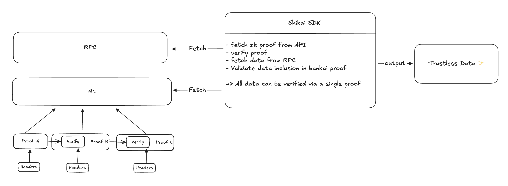
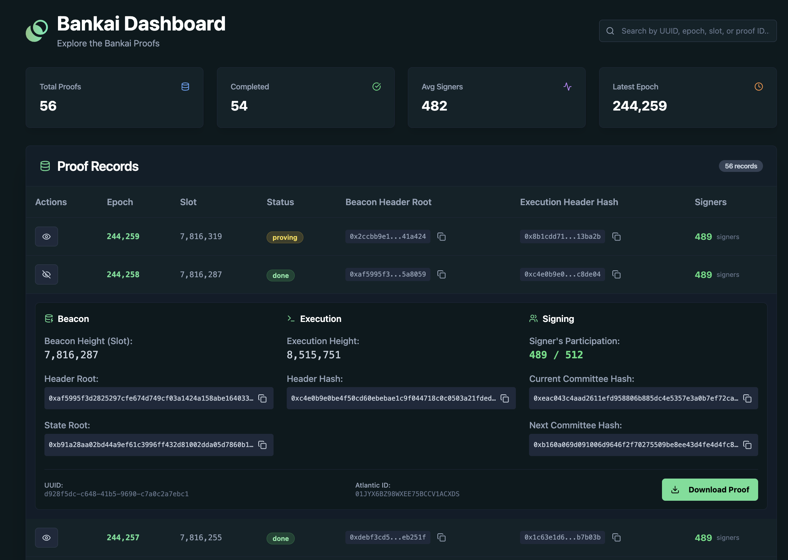

# Bankai

This repository contains the components for Bankai, a stateless light client for Ethereum. It leverages recursive STARKs to provide trustless access to Ethereum's state, which can be verified on-chain or on any client-side application.

## Shikai SDK

Shikai is a client-side SDK designed to interact with the proofs generated by the Cairo programs. It allows developers to not only verify the recursive STARK proofs but also to decommit (i.e., extract) specific data from the verified state.

A primary use case for Shikai is to validate data received from any standard Ethereum RPC provider. By fetching a proof from the API and the corresponding data from an RPC endpoint (e.g., Infura, Alchemy, or a local node), a developer can use Shikai to cryptographically verify that the data is correct and part of the canonical chain. This completely removes the need to trust the RPC provider, enabling the development of truly trustless applications.

### Available Getters

Shikai provides several getters to decommit and verify specific parts of the Ethereum state.

#### Beacon Header
Retrieves a verified Beacon Chain header.

| Field             | Type   | Description                               |
| ----------------- | ------ | ----------------------------------------- |
| `slot`            | `u64`  | The slot number of the beacon block.      |
| `proposer_index`  | `u64`  | The index of the validator that proposed the block. |
| `parent_root`     | `bytes32` | The root of the parent block.             |
| `state_root`      | `bytes32` | The root of the beacon state.             |
| `body_root`       | `bytes32` | The root of the beacon block body.        |

#### Execution Header
Retrieves a verified Execution Layer header.

| Field                 | Type      | Description                               |
| --------------------- | --------- | ----------------------------------------- |
| `parent_hash`         | `bytes32` | The hash of the parent block.             |
| `state_root`          | `bytes32` | The root of the world state trie.         |
| `transactions_root`   | `bytes32` | The root of the transactions trie of the block. |
| `receipts_root`       | `bytes32` | The root of the receipts trie of the block. |
| `number`              | `u64`     | The block number.                         |
| `timestamp`           | `u64`     | The timestamp of the block.               |
| `gas_limit`           | `u64`     | The gas limit for the block.              |
| `gas_used`            | `u64`     | The total gas used in the block.          |
| `base_fee_per_gas`    | `u256`    | The base fee per gas.                     |

#### Account
Retrieves verified information about an Ethereum account.

| Field          | Type      | Description                                  |
| -------------- | --------- | -------------------------------------------- |
| `nonce`        | `u64`     | The number of transactions sent from the account. |
| `balance`      | `u256`    | The account balance in Wei.                  |
| `storage_hash` | `bytes32` | The root of the account's storage trie.      |
| `code_hash`    | `bytes32` | The hash of the EVM code of this account.    |

#### Transaction
Retrieves a verified transaction.

| Field                      | Type      | Description                                  |
| -------------------------- | --------- | -------------------------------------------- |
| `type`                     | `u8`      | The transaction type.                        |
| `chain_id`                 | `u64`     | The chain ID.                                |
| `nonce`                    | `u64`     | The nonce of the sender.                     |
| `max_priority_fee_per_gas` | `u256`    | The maximum priority fee per gas.            |
| `max_fee_per_gas`          | `u256`    | The maximum fee per gas.                     |
| `gas_limit`                | `u64`     | The gas limit for the transaction.           |
| `to`                       | `address` | The recipient address.                       |
| `value`                    | `u256`    | The amount of Ether transferred.             |
| `data`                     | `bytes`   | The input data of the transaction.           |
| `v`, `r`, `s`              | `u256`    | The signature values of the transaction.     |

## Cairo Programs

The core logic of the light client is implemented in Cairo. These programs are responsible for trustlessly verifying the progression of the Ethereum blockchain. This is achieved by validating the signatures from Ethereum's sync committee for each consensus epoch.

The process is recursive:

1.  A STARK proof is generated for a single epoch update, attesting to its validity.
2.  These individual epoch proofs are then recursively combined. For instance, proofs for multiple epochs can be aggregated into a single proof, which in turn can be combined with other aggregated proofs.

This recursive process allows for compressing the validity of thousands of epochs into a single, compact STARK proof. The final output is a STARK-proven, deterministic Cairo program that can be used to verify a large portion of Ethereum's history without needing to sync the entire chain.

## Dashboard

The project includes a web-based dashboard to provide a visual interface for the light client's state and proofs. It allows users to monitor the proof generation pipeline, explore generated proofs, inspect the data they contain, and download them for local use.

From the dashboard, you can:
- View all proof records with their corresponding epoch, slot, and status.
- Expand each record to see detailed information about the Beacon and Execution headers, as well as signing information like signer participation.
- Download individual proofs.
- Search for specific proofs by UUID, epoch, or slot.

## API

The generated proofs are made available through a RESTful API. This allows for easy access for clients and applications to fetch the proofs they need for verification.

### Endpoints

-   `GET /epochs`
    -   Fetches all available epoch updates that have been processed.

-   `GET /proofs/:id`
    -   Fetches a specific proof by its database ID.

-   `GET /beacon/:height`
    -   Fetches a proof corresponding to a specific beacon chain block height.

-   `GET /execution/:height`
    -   Fetches a proof corresponding to a specific execution layer block height.
